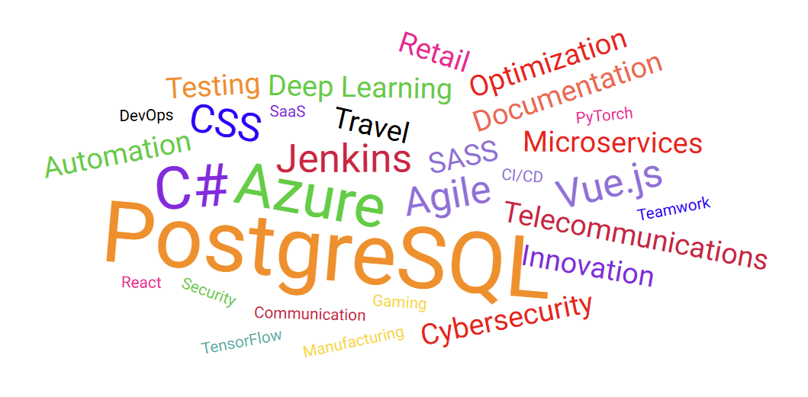

# Wordcloud Component

The `WordcloudComponent` is an Angular standalone component for rendering interactive word clouds using D3.js. It is designed for flexibility, performance, and visual appeal, supporting up to **90 words** in a single cloud.



## Features

- **Display up to 90 words**: Efficiently lays out and renders up to 90 words, adapting the layout to maximize word placement.
- **Adaptive scaling and retry logic**: Automatically scales and retries the layout up to 5 times to fit as many words as possible, ensuring optimal use of space.
- **Word size mapping**: Supports five word sizes (`small`, `medium`, `large`, `extra-large`, `huge`) for visual emphasis.
- **Custom colors**: Each word can have a custom color for enhanced visual distinction.
- **Animated transitions**: Smoothly animates word entry, update, and exit for a polished user experience.
- **Responsive SVG rendering**: Uses SVG for crisp, scalable graphics and adapts to container size.
- **Click events**: Emits a `linkclick` event when a word is clicked, allowing for interactive behavior.
- **Loading state**: Displays a loading spinner and message while data is being fetched.
- **Browser-only rendering**: Detects platform and only renders the word cloud in browser environments.
- **Placement algorithm**: Uses an Archimedean spiral and collision detection to avoid overlapping words and maximize fit.
- **Custom aspect ratio**: Default aspect ratio is 16:9 (640x360), but can be adjusted in the code.

## Usage

Import the component and use it in your Angular templates:

```html
<core-word-cloud [words]="wordList" [loading]="isLoading"></core-word-cloud>
```

- `words`: Array of word objects with `text`, `size`, and optional `color`.
- `loading`: Boolean to show the loading spinner.

## Word Object Structure

```typescript
type WordcloudWord = {
  text: string;
  size: 'small' | 'medium' | 'large' | 'extra-large' | 'huge';
  color?: string;
};
```

## Events

- `linkclick`: Emits the word text when a word is clicked.

## Limitations

- Maximum recommended word count: **90**. More words may reduce readability and placement success.
- Only supports browser environments (no server-side rendering).

## Example

```typescript
const words: WordcloudWord[] = [
  { text: 'Angular', size: 'huge', color: '#dd0031' },
  { text: 'D3.js', size: 'large', color: '#f9a825' },
  // ... up to 90 words
];
```

## Customization

- Adjust the aspect ratio or size by modifying the `size` property in the component.
- Change word sizes by updating the `getVisualSize` mapping.

## License

MIT
