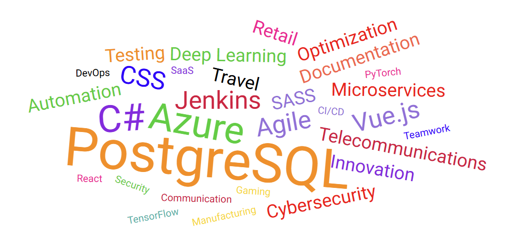

# Angular Wordcloud Component

An Angular standalone component for rendering interactive word clouds with up to **90 words**. Features animated transitions, responsive SVG rendering, and custom styling options.

## Live Demos

- **[Basic Demo](https://kern.pro/en/wordcloud/test)** - Component in action
- **[Custom Loader Demo](https://kern.pro/en/wordcloud/test-custom-loader)** - With custom loading spinner



## Features

- **Up to 90 words** with efficient placement algorithm (Archimedean spiral + collision detection)
- **Custom colors** and **animated transitions**
- **Responsive SVG rendering** with configurable aspect ratio (default 16:9)
- **Click events** and **loading state** support
- **Browser-only rendering** with graceful SSR handling

## Installation

```bash
npm install @kernpro/angular-wordcloud
```

## Quick Start

```typescript
import { WordcloudComponent, WordcloudWord } from '@kernpro/angular-wordcloud';

const words: WordcloudWord[] = [
  { text: 'Angular', size: 'huge', color: '#dd0031' },
  { text: 'TypeScript', size: 'large', color: '#3178c6' },
];
```

```html
<kp-wordcloud [words]="words" />
```

## API

### Inputs

- **`words`**: `readonly WordcloudWord[]` - Array of words to render (default: `[]`)
- **`loading`**: `boolean` - Shows loader when `true` (default: `false`)
- **`size`**: `Readonly<Size>` - SVG dimensions (default: `{width: 640, height: 360}`)

### Outputs

- **`layoutComplete`**: `void` - Emitted when layout finishes
- **`linkclick`**: `string` - Emitted with word text when clicked

### Types

```typescript
type WordcloudWord = {
  text: string;
  size: 'small' | 'medium' | 'large' | 'extra-large' | 'huge';
  color?: string;
};

type Size = {
  width: number;
  height: number;
};
```

### Custom Loading Content

Use content projection with `slot="loader"` for custom loading UI. Without custom content, displays default CSS spinner with "Loading..." text.

```html
<kp-wordcloud [words]="words" [loading]="true">
  <div slot="loader">
    <mat-spinner diameter="50"></mat-spinner>
    <p>Processing your data...</p>
  </div>
</kp-wordcloud>
```

## Complete Example

```typescript
import { Component } from '@angular/core';
import { WordcloudComponent, WordcloudWord } from '@kernpro/angular-wordcloud';

@Component({
  template: `
    <kp-wordcloud
      [words]="words"
      [loading]="isLoading"
      (layoutComplete)="onReady()"
      (linkclick)="onWordClick($event)"
    />
  `,
  imports: [WordcloudComponent],
})
export class MyComponent {
  isLoading = true;

  words: WordcloudWord[] = [
    { text: 'Angular', size: 'huge', color: '#dd0031' },
    { text: 'TypeScript', size: 'large', color: '#3178c6' },
    { text: 'Component', size: 'medium', color: '#42a5f5' },
    { text: 'Reactive', size: 'large', color: '#66bb6a' },
    // ... up to 90 words total
  ];

  onReady() {
    this.isLoading = false;
  }

  onWordClick(word: string) {
    console.log('Clicked:', word);
  }
}
```

## Limitations & Notes

- **Maximum recommended words**: 90 (more reduces readability and placement success)
- **Placement**: Words that can't fit are skipped (no adaptive scaling)
- **Browser-only**: No server-side rendering support
- **Algorithm**: Uses Archimedean spiral with collision detection, inspired by d3-cloud

## License

MIT License. This library was inspired by [d3-cloud](https://github.com/jasondavies/d3-cloud) (BSD-3-Clause License).

For full third-party notices and attributions, see [THIRD_PARTY_NOTICES.md](THIRD_PARTY_NOTICES.md).
